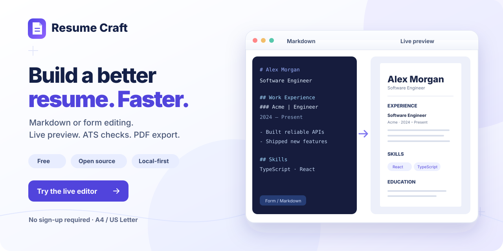

<p align="center">
  
</p>

<h1 align="center">🚀 Resume Craft</h1>

<h3 align="center">Local-first Markdown Resume Builder</h3>

<p align="center">
  Build and tailor A4 or US Letter resumes with Markdown, structured forms, ATS checks, and direct PDF export.
</p>

<p align="center">
  <a href="https://kunlong-luo.github.io/resume-craft/"><strong>Live Demo</strong></a>
  ·
  <a href="./README.md">简体中文</a>
  ·
  <a href="https://github.com/kunlong-luo/resume-craft/discussions">Feedback / Discussions</a>
  ·
  <a href="https://github.com/kunlong-luo/resume-craft/releases/latest">Latest Release</a>
</p>

<p align="center">
  <a href="https://github.com/kunlong-luo/resume-craft/actions/workflows/ci.yml"></a>
  <a href="https://github.com/kunlong-luo/resume-craft/releases/latest"></a>
  <a href="./LICENSE"></a>
</p>

> **Resume Craft** is for job seekers and developers who want to spend less time fighting Word layouts. It combines Markdown, structured forms, and a live A4 / US Letter preview in a local-first workflow that works without an account.
>
> **Markdown ↔ Form · A4 / US Letter Preview · ATS Checks · Auto Fit · PDF Export · Local-first · PWA**
>
> Resume drafts and settings are primarily stored in the browser. ATS checks, layout tools, and PDF generation run on the client, while optional share links provide a lightweight way to send a resume to others.

---

## 🆕 What's New in v2.3.0

- Moves durable resume-owned data from synchronous `localStorage` payloads to Dexie + IndexedDB, including active Markdown, profiles, drafts / automatic backups, and JD text.
- Keeps Zustand as the runtime editor state while small UI/bootstrap preferences such as theme, language, zoom, layout, and onboarding remain in `localStorage`.
- Adds a verified v2.2 → v2.3 migration that writes to IndexedDB, reads the records back, and removes legacy core keys only after successful verification.
- Moves editor persistence to asynchronous debounced and serialized writes, reducing large synchronous JSON writes on the editing hot path.
- Adds multi-tab presence warnings, Web Locks serialization where supported, and scoped clearing across IndexedDB plus Resume Craft-owned localStorage keys.
- Adds repository, migration, clear-data, and cross-browser E2E coverage, including a development-preview IndexedDB v1 → v2 upgrade path.

See the full [v2.3.0 Release](https://github.com/kunlong-luo/resume-craft/releases/tag/v2.3.0).

---

## 💡 Why Choose Resume Craft?

When creating resumes, candidates frequently suffer from **Word layout nightmares**, **PDF export font corruptions**, **unwanted 1.1-page spills**, and **multi-device font distortion**. Resume Craft provides an end-to-end engineered solution:

```
+-----------------------------------------------------------------------------------+
|                                  RESUME CRAFT                                     |
|                                                                                   |
|  [ Structured Form ] <=========( Real-Time AST Bi-Sync )=========> [ Markdown ]   |
|          |                                                             |          |
|          +---------------------> [ A4 Canvas Core ] <------------------+          |
|                                         |                                         |
|    +------------------------------------+-----------------------------------+    |
|    |                                    |                                   |    |
| [ 1-Click Smart Auto-Fit ]    [ Fallback Font Stack ]      [ ATS JD Keyword Audit ]|
|    |                                    |                                   |    |
|    +------------------------------------+-----------------------------------+    |
|                                         |                                         |
|                   +---------------------+---------------------+                   |
|                   |                                           |                   |
|         [ ATS PDF / Quick PDF ]                      [ H5 Share Link ]   |
+-----------------------------------------------------------------------------------+
```

---

## 🌟 Core Highlights

### 1. 🔄 Visual Form & Markdown Bi-Directional Sync Engine
* **Bi-Directional Sync**: Seamlessly edit in either the "Structured Form" or "Markdown Source" with real-time updates across the form, Markdown source, and live preview.
* **Drag & Drop Reordering**: Native grip handles allow mouse drag-and-drop to reorder experiences or skills instantly, updating both Markdown text and live previews.

### 2. ⚡ 1-Click Auto Fit & Paper Boundary Control
* **Eliminate Page Spills**: Say goodbye to 1.1-page awkward overflows. The lightning button dynamically adjusts margins, line height, and section padding to fit everything onto a pristine 1-page document.
* **Paper Boundary Indicators**: Preview and print support A4 and US Letter, with page boundaries matched to the current market and paper settings.

### 3. ✨ Local PDF / File / Raw Text Import
* **Local PDF extraction**: Select a PDF with a text layer and PDF.js extracts the text entirely in the browser; the file is not uploaded to a Resume Craft server.
* **Machine-readability check**: Before import, the app summarizes text extraction quality plus detected email, phone, and common section headings as an ATS-readability proxy. It is not a guarantee or score from any specific ATS.
* **Smart normalization**: Extracted PDF text, `.txt` files, and pasted raw text are locally converted into editable Markdown with contact, experience, and skills structure.
* **Current limits**: Image-only/scanned PDFs are not OCR'd yet. Password-protected PDFs or files without a usable text layer are rejected with a fallback suggestion.

### 4. 🎯 ATS Job Matching & Smart Audit System
* **JD Keyword Matching**: Paste target Job Descriptions to analyze match percentage and highlight missing keywords.
* **Formatting Audit**: Scans for missing contact details, overlapping timeline dates, and inconsistent technology capitalization (e.g., auto-suggesting `React` over `react`).

### 5. ✍️ Bilingual Spacing Helper
* **Aesthetic Typography**: Automatically inserts aesthetic spaces between Chinese characters, English words, and numbers to optimize document readability.

### 6. 🎨 Industry Color Palettes & Layout Customization
* **Custom Styling**: Select from Indigo, Slate, Emerald, and Amber color palettes; customize single/two-column layouts, base font size (13/14/15px), line height, and header line accents.

### 7. 🔤 System Font Stack & A4 / US Letter Layout Consistency
* **Cross-platform consistency**: The UI and resume canvas use system font stacks (for example PingFang SC, Microsoft YaHei, and Source Han Sans SC) instead of Google Fonts CDN, and the preview scales from the selected A4 / US Letter paper size. Small cross-platform font-metric differences can still occur.

### 8. 💾 Multi-Profile Matrix & Diff Comparison
* **Version Control**: Clone and maintain tailored resume branches for different roles (e.g., `Frontend Lead`, `Full-Stack Developer`).
* **Diff Analysis**: View side-by-side diff highlights comparing text changes and keywords between two versions.

### 9. 🔒 H5 Link Sharing & Optional Encryption
* **Convenient Sharing**: Public links contain a readable resume payload, while password-protected links encrypt the resume locally in the browser before the link is created. The password is never stored in the link. Treat public links as readable by anyone who receives them, and send passwords separately from encrypted links when possible.

### 10. 📐 Section Sorter
* **Module Reordering**: Automatically detects Markdown section headers (`H2`) and allows moving entire sections up or down with one click.

### 11. 🌙 Dark Mode with Canvas Isolation
* **Eye Comfort**: Full tactile Dark Mode theme with styling isolation so resume previews always maintain pristine white paper with crisp dark text.

### 12. 🌐 Bilingual Localization & Target Market
* **Instant Switch**: Toggle between English (`en`) and Chinese (`zh`) with full UI, template, and diagnostic translation.
* **Target Market**: Choose United States, Canada, United Kingdom, Ireland, China, or International. While defaults are still in use, the market setting can recommend paper size and date style without overwriting manual choices.
* **Localized paper and dates**: Supports A4 / US Letter plus date styles such as `2026.09`, `Sep 2026`, and `September 2026`.

### 13. ⚡ PWA & Local-First Storage
* **Local First**: Installable as a desktop or mobile PWA. Core resume content, profiles, drafts / automatic backups, and JD text are persisted in this browser's IndexedDB; small preferences such as theme, language, and zoom remain in localStorage. The project does not provide an application backend for persisting resume content. New share links keep their payload in the URL fragment; only share them with trusted recipients.

---

## 📂 Source Directory Architecture

```
.
├── .github/
│   ├── dependabot.yml           # Dependabot automated weekly checks
│   └── workflows/
│       ├── ci.yml               # CI build & test check pipeline
│       ├── deploy.yml           # Deploy main to GitHub Pages
│       ├── release.yml          # Stable release after package version changes
│       ├── seo-submit.yml       # Optional IndexNow submission after deploy
│       └── promote.yml          # Cross-post new content (dry-run by default)
├── src/
│   ├── assets/                  # Icons & static media assets
│   ├── components/              # Layered UI component architecture
│   │   ├── form/                # Visual structured form input fields
│   │   ├── layout/              # Topbar, sidebar & split layout wrappers
│   │   ├── modals/              # ATS, password lock, draft diff modals
│   │   ├── preview/             # A4 canvas renderer & ZoomControls
│   │   ├── share/               # Public H5 share page component
│   │   └── toolbar/             # Quick action bar & AutoFit controls
│   ├── context/                 # Global React contexts
│   ├── data/                    # Initial templates in EN & ZH
│   ├── hooks/                   # Custom hooks (A4 measurement, shortcuts)
│   ├── i18n/                    # Localization dictionaries
│   ├── lib/                     # AST parsers, Auto-Fit, sharing & storage utilities
│   ├── store/                   # Zustand reactive state store
│   ├── types.ts                 # TypeScript type definitions
│   ├── index.css                # Tailwind CSS v4 & theme variables
│   └── main.tsx                 # Application entrypoint
├── index.html                   # HTML template entry
├── package.json                 # Project dependencies & scripts
├── vite.config.ts               # Vite 8 bundler configuration
└── README.md                    # Main documentation
```

---

## 🛠️ Tech Stack

| Category | Technology | Description |
| :--- | :--- | :--- |
| **Frontend** | React 19 + TypeScript 7 | Type-safe, high-performance UI rendering |
| **Bundler** | Vite 8 | Instant HMR & fast production builds |
| **Styling** | Tailwind CSS v4 | Atomic styling with modern CSS variables |
| **State** | Zustand 5 | Lightweight reactive runtime state |
| **Local Persistence** | Dexie 4 + IndexedDB | Durable storage for core resumes, profiles, drafts / backups, and JD data |
| **Animations** | Motion 13 | Smooth drag-and-drop & modal transitions |
| **Markdown** | `react-markdown` + `remark-gfm` | GFM-compliant markdown parsing |
| **PDF Import / Export** | `pdfjs-dist` + browser print + `html2canvas-pro` + `jspdf` | Local text extraction and readability feedback plus ATS-friendly Save as PDF and image-based Quick PDF fallback |

---

## 🚀 Quick Start Guide

### 1. Clone Repository
```bash
git clone https://github.com/kunlong-luo/resume-craft.git
cd resume-craft
```

### 2. Install Dependencies
```bash
pnpm install
```

### 3. Run Development Server
```bash
pnpm dev
```
Open `http://localhost:3000` in your browser to start editing.

### 4. Scripts Overview

| Command | Description |
| :--- | :--- |
| `pnpm dev` | Start Vite dev server on port 3000 |
| `pnpm build` | Build production assets into `dist/` |
| `pnpm lint` | Run TypeScript static type checker |
| `pnpm test` | Run Vitest unit test suite |
| `pnpm preview` | Preview production build locally |
| `pnpm check:stable-deps` | Reject direct dependency pre-releases |

---

## 📈 PDF Download & Print Guide

Resume Craft provides two export paths:

1. **ATS PDF (default, recommended)**: click **ATS PDF** or press **Ctrl/Cmd + P**, then choose **Save as PDF** in the browser print flow. Where supported by the browser, this preserves searchable/selectable text and is the preferred path for job applications and ATS parsing.
2. **Quick PDF (fallback)**: uses `html2canvas-pro + jsPDF` to rasterize the currently selected paper canvas into an image-based PDF. It is useful for fast downloads, visual sharing, or environments where browser printing is blocked, but it is not the preferred ATS submission format.

While editing, use the current A4 / US Letter paper boundaries and **1-Click Auto Fit** to check pagination. For the browser print path (Chrome / Edge / Safari), recommended settings are:

* **Destination**: `Save as PDF` (recommended for ATS submissions)
* **Paper Size**: match the resume setting with `A4` or `Letter`
* **Margins**: try **`None`** first and confirm against the preview
* **Options**: enable **`Background graphics`** when needed
* **Headers and Footers**: disable them

---

## 🔐 Privacy & Security Boundaries

Resume Craft is local-first, but local-first does not mean that every stored or shared value is cryptographically encrypted.

- Core resumes, profiles, drafts / automatic backups, and JD text are stored in this browser's IndexedDB; small UI preferences such as theme, language, and layout remain in `localStorage`.
- The project does not provide an application backend for persisting resume content.
- Fonts use local system stacks and are not loaded from third-party font CDNs such as Google Fonts.
- The product uses Simple Analytics for a small set of anonymous aggregate signals (editing, export, ATS matching, Auto Fit, sharing, PWA installation, and feedback intent). Events contain only a fixed event name and no metadata. Do Not Track is respected and the analytics script is not loaded when DNT is enabled; resume, JD, contact, filename, share-payload, and access-code content are never sent, and session replay/fingerprinting are not used.
- New share URLs keep the payload in the URL fragment so it is not sent to the hosting server as a request query; legacy `?share=` links remain compatible. Public links are not content-encrypted; password-protected shares are encrypted locally in the browser, and the password is never placed in the link.
- Do not include real resume data, tokens, passwords, or other sensitive information in issues, pull requests, test fixtures, or screenshots.
- Product feedback and ideas can go to [GitHub Discussions](https://github.com/kunlong-luo/resume-craft/discussions); no resume content is attached automatically.
- Report security issues through the private process described in [SECURITY.md](SECURITY.md).

---

## 🤝 Contributing & Community

Bug reports, feature ideas, and code contributions are welcome. Before contributing, please read:

- [Contributing Guide](CONTRIBUTING.md) — development setup, commit conventions, and pull request workflow
- [Code of Conduct](CODE_OF_CONDUCT.md) — community expectations
- [Security Policy](SECURITY.md) — report vulnerabilities privately; do not publish sensitive details
- [Support](SUPPORT.md) — where to ask for help or report problems

Before opening a pull request, make sure `pnpm lint`, `pnpm test`, and `pnpm build` all pass.

---

## 📄 License

Distributed under the [MIT License](LICENSE). Free for personal and commercial use.
